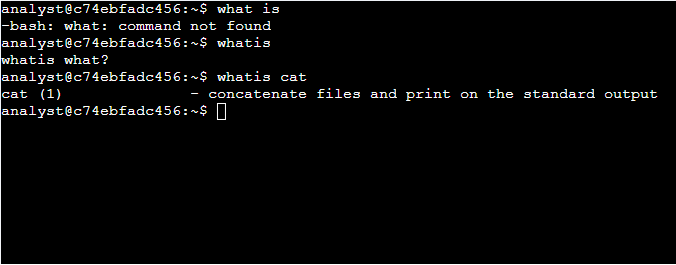
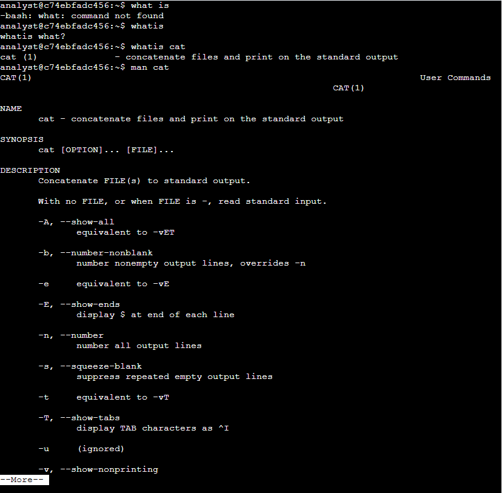
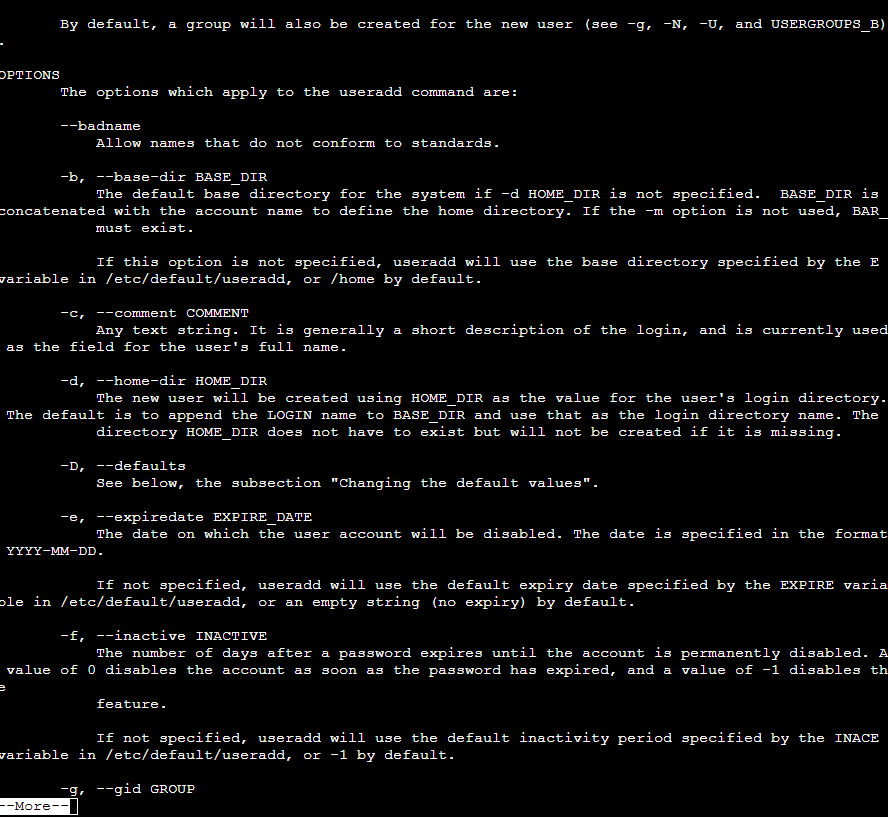
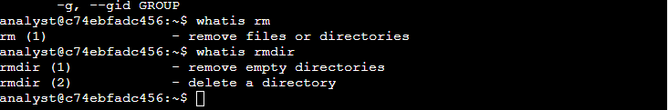
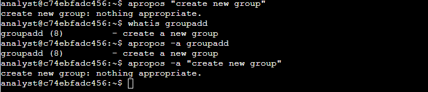

# Lab 02 — Linux Help & Command Discovery


## Executive Summary

This lab demonstrates the use of Linux's built-in self-documentation tools — `whatis`, `man`, and `apropos` — to identify and correctly apply commands without relying on memorization or external search. In a live SOC environment, analysts frequently need to confirm exact command syntax or discover the right tool for a task in real time; this lab builds that discovery workflow from first principles.

## SOC Competencies Demonstrated

- **Self-Service Troubleshooting** — resolving command uncertainty independently and quickly, without breaking triage flow to search externally.
- **Precision Under Ambiguity** — using targeted keyword search (`apropos`) to narrow down the correct tool from a vague requirement.
- **Documentation Literacy** — reading and interpreting `man` pages to correctly select command flags (critical for not misconfiguring a system mid-incident).

## Tools Used

| Command | Purpose |
|---|---|
| `whatis` | One-line command summary lookup |
| `man` | Full manual page — syntax, description, all options |
| `apropos` | Keyword search across manual page descriptions |

## Methodology & Results

### Task 1 — Command Lookup Fundamentals

```bash
$ whatis cat
cat (1) - concatenate files and print on the standard output
```

Confirmed `cat`'s function without opening the full manual.



Followed up with `man cat` to review all available options:

```bash
$ man cat
...
-n, --number
       number all output lines
```

**Result:** `-n` numbers all output lines (`-b` numbers *non-blank* lines only — a distinction worth knowing before using either in a log review context, where blank lines can matter).



Then used `apropos` to find a command by describing its function rather than naming it:

```bash
$ apropos -a first part file
head (1) - output the first part of files
```

**Result:** `head` — found without knowing the command name in advance.


### Task 2 — Reading `man` Pages for Specific Options

**Scenario:** Set an expiration date on a temporary user account via `useradd`, without prior knowledge of the correct flag.

```bash
$ man useradd
...
-e, --expiredate EXPIRE_DATE
       The date on which the user account will be disabled.
       The date is specified in the format YYYY-MM-DD.
```

**Result:** `-e` — confirmed directly from documentation rather than assumption. This matters operationally: guessing a flag on an account-modifying command risks unintended privilege or access changes.



### Task 3 — Differentiating Similar Commands

**Scenario:** Confirm the behavioral difference between `rm` and `rmdir` before using either in a cleanup task.

```bash
$ whatis rm
rm (1) - remove files or directories

$ whatis rmdir
rmdir (1) - remove empty directories
```

**Result:** `rmdir` only removes *empty* directories — a meaningful safety distinction. Using `rm` where `rmdir` was intended risks unintended data loss.



### Task 4 — Discovering a Command from a Functional Description

**Scenario:** Identify the correct command to create a new group, using only the keywords `create new group`.

```bash
$ apropos "create new group"
create new group: nothing appropriate.

$ apropos -a create new group
groupadd (8) - create a new group
```

**Result:** `groupadd`. Notably, the quoted multi-word search returned nothing — `apropos` matches more reliably on individual keywords passed with `-a` than on a quoted phrase. This is a small but real operational lesson: search syntax matters, and a failed first attempt doesn't mean the tool or the command doesn't exist.



## Key Takeaways

| Task | Command Identified | Why It Matters |
|---|---|---|
| Number output lines | `cat -n` | Correct flag selection prevents misleading log/file output |
| Set account expiry | `useradd -e` | Prevents guesswork on identity lifecycle commands |
| Empty-dir-only removal | `rmdir` | Avoids destructive misuse of `rm` |
| Group creation via keyword search | `groupadd` (via `apropos -a`) | Demonstrates ability to find the right tool without prior knowledge |

## Reflection

This lab reinforced that command-line fluency isn't about memorizing every flag — it's about knowing *how to ask the system for the answer* quickly and correctly. That's directly transferable to SOC triage, where confirming exact syntax before running a command against a live system is a habit, not an inconvenience.
